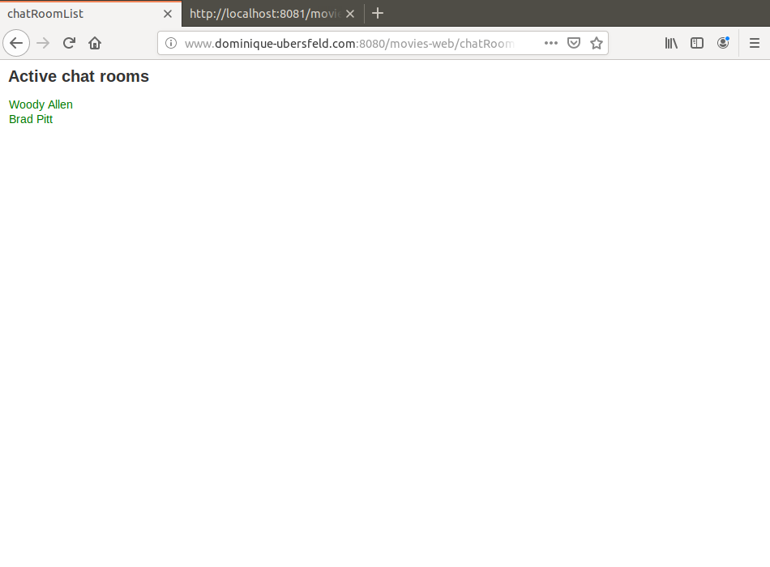
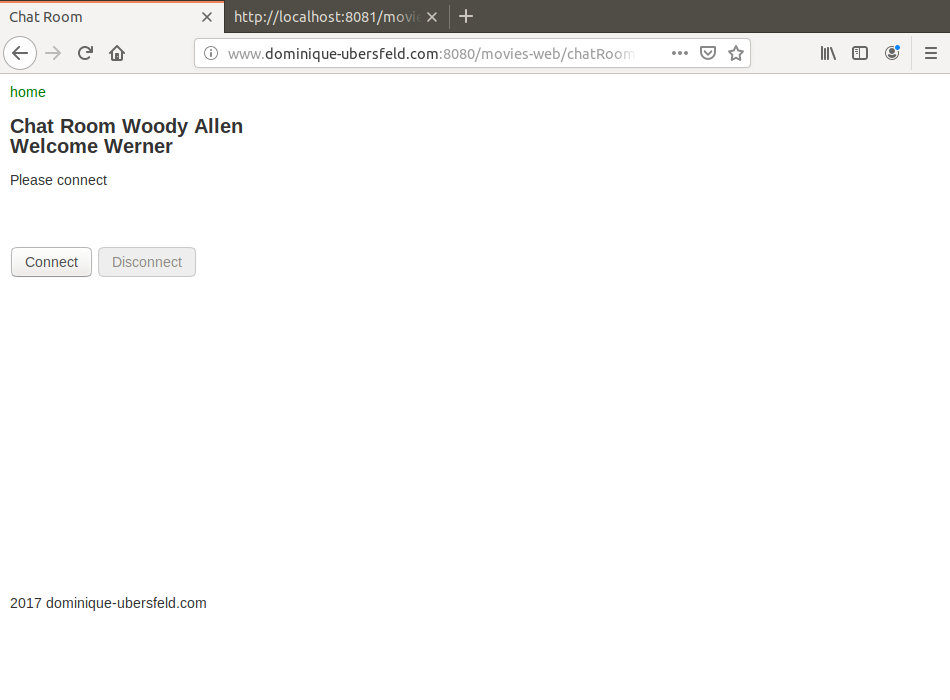
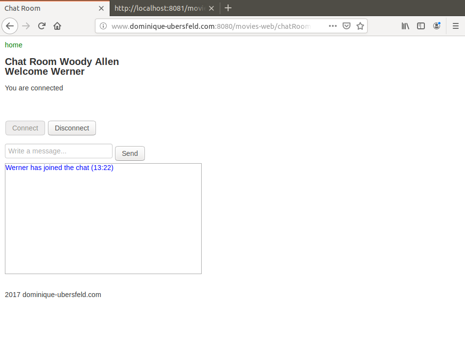
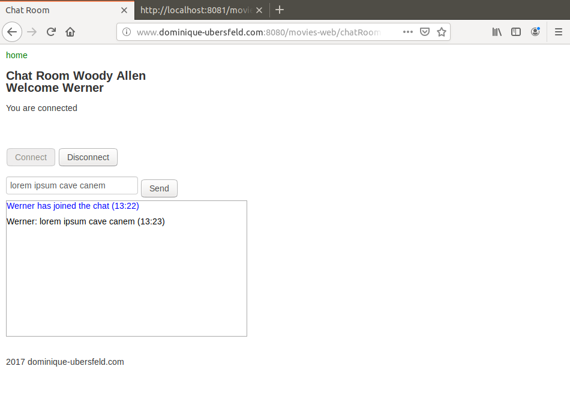
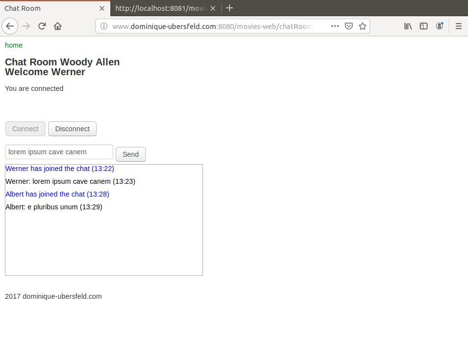
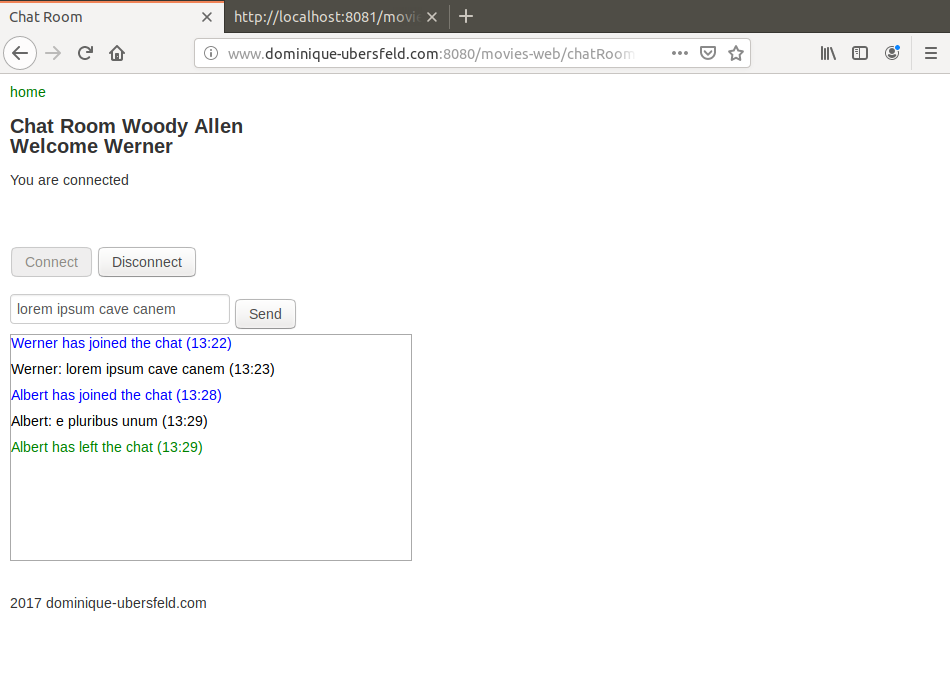

# MoviesWebChat
Spring based Web site with CrudRepository support and Spring Security , running on Tomcat 8 with Maven build with a WebSockets based chat room

This is a demonstration project on Spring development. It involves:
MySQL as a database server
Maven as a build tool

moviesDBChat.sql was used to generate the MySql database used in this project.

When the project has started open a browser and hit URL `localhost:8080/movies-web`.

# Connecting to a Chat Room

To get the ChatRoom list click on link `ViewChatRooms`. The response page should look like this:

Select a chat room. The response page should look like this:

Connect to chat room. The response page should look like this:

Send a message. The response page should look like this:

# Connecting as a different user

To connect as a different user you need to open a different browser to create a different session. Then the initial page should look like this:

After the new user sent a message the initial page should look like this:

Disconnect the new user. The initial page should look like this:

Note on authorities:

I have predefined 5 authorities: VIEW, CREATE, UPDATE, DELETE, CHAT

The source file moviesDBSecu.sql declares 5 users with different authorities and passwords listed below:

Username        Password        Authorities

Carol           s1a2t3o4r       VIEW, CHAT

Albert          a5r6e7p8o       VIEW, CHAT

Werner          t4e3n2e1t       VIEW, CHAT

Alice           o8p7e6r5a       VIEW, CREATE, UPDATE, CHAT

Richard         r1o2t3a4s       VIEW, CREATE, UPDATE, DELETE, CHAT

Moreover any new user can register and be granted the only VIEW and CHAT authorities. All menus are customized to display only the requests that are allowed to the actual user.

Note that a given user is only allowed a single connection to a given chatroom, i.e. he cannot connect at the same time from two different IPs such as a desktop and a smartphone.

For the basic JDBC version of this project see the repository:

https://github.com/dubersfeld/MoviesWebJDBC

For the JPQL version of this project see the repository:

https://github.com/dubersfeld/MoviesWebJPQL

For the Criteria version of this project see the repository:

https://github.com/dubersfeld/MoviesWebCriteria

For the CrudRepository version of this project see the repository:

https://github.com/dubersfeld/MoviesWebCrud

For the Spring Security version of this project see the repository:

https://github.com/dubersfeld/MoviesWebSecurity

Dominique Ubersfeld, Cachan, France 
